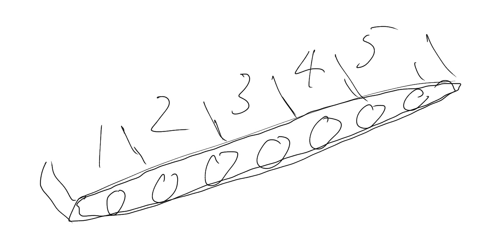
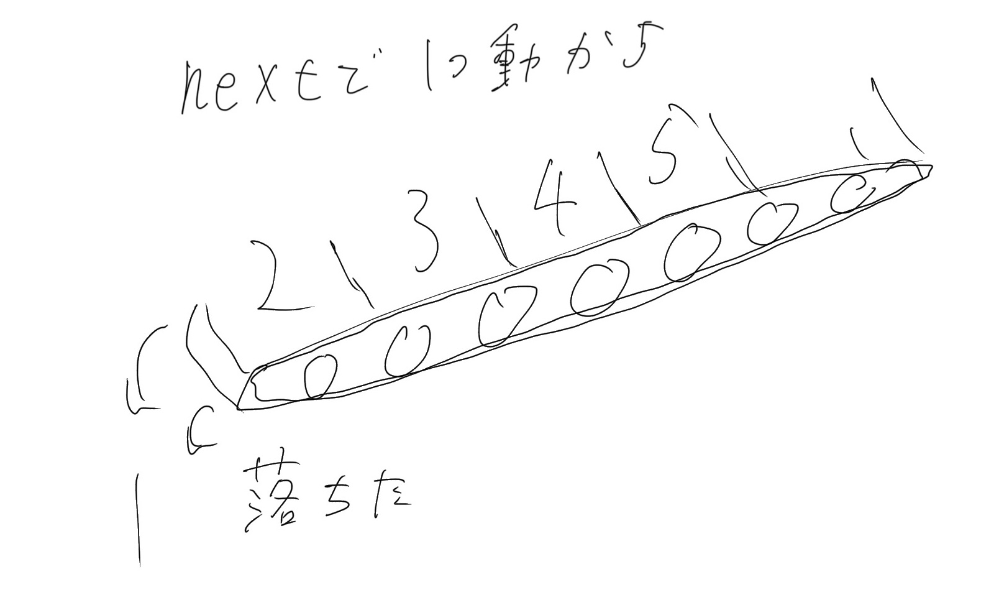
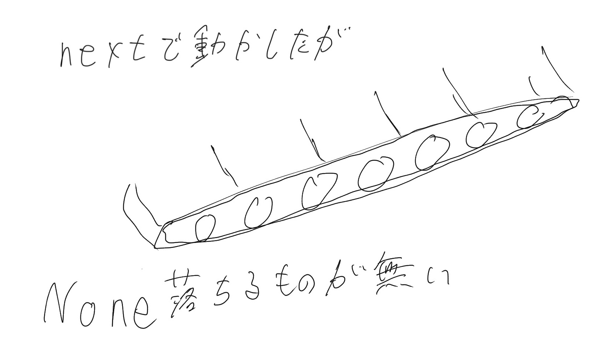
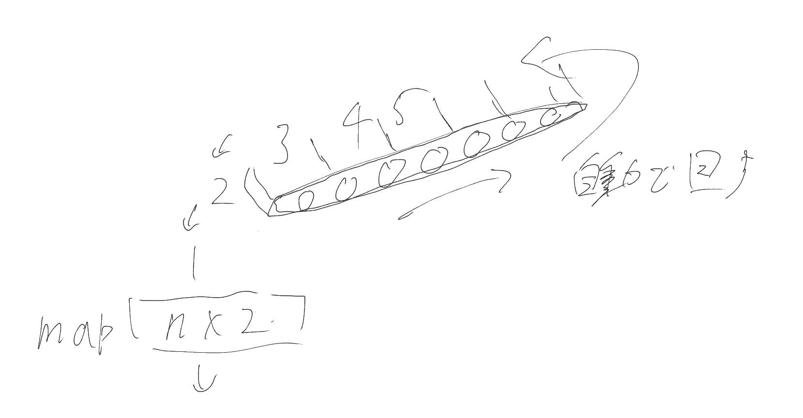
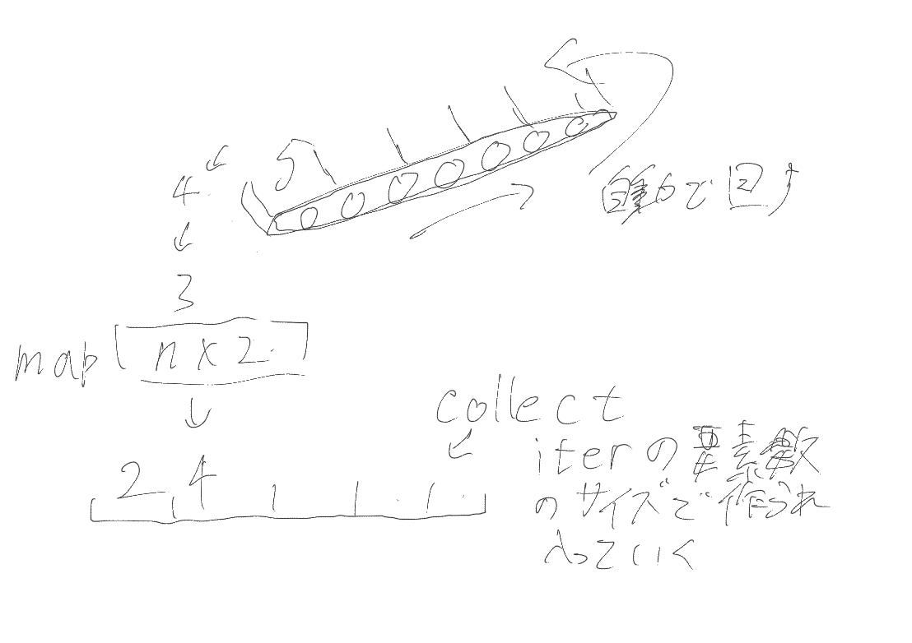
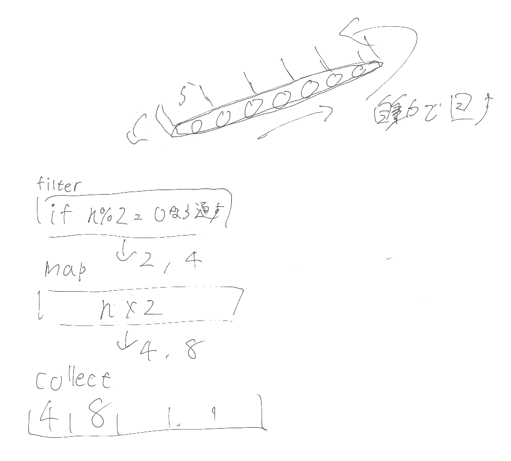

# イテレータ
最初はさっぱりだった記憶があるので、丁寧に解説したい。

## イテレータとは
データの集合(ベクタや配列など)から要素を1つずつ取り出して処理するための仕組み。

簡単にいうと、`for _ in 0..=5`は[0,1,2,3,4,5]という配列の要素を終わるまで一つずつ取り出してるが、これはイテレータを1つずつ取り出してる。実はシンタックスシュガーなのです。

**forをiter(イテレータ)で書いてみよう**
これは軽く読む程度でいいです
```rust
fn main() {
    let range = vec![0,1,2,3,4,5];

    // .iter()で、rangeのイテレータを作成
    // .for_eachで、イテレータで回ってきた要素に関数を適用。戻り値無し。
    // 要素は参照型なので、アスタリスクで外す
    range.iter().for_each(|n| println!("{}", *n));


    // 実際には上の例だとbreakやcontinueが使えないし、
    let mut iter = range.into_iter(); // .into_iter()で所有権を取り、値を消費する。
    while let Some(n) = iter.next() { // .next()で次の要素を取得
        println!("{}", n);
    }
    // こっちだと思う
}
```

## イテレータの種類と作り方
その種類を作成するメソッドと、その種類の性質です。
|メソッド|生成される種類|用途|
|---|---|---|
|`iter()`|`&T`(不変参照)|データを読むだけ。元のデータは残る|
|`iter_mut()`|`&mut T`(可変参照)|データを書き換えたいとき。元のデータは残る|
|`into_iter()`|`T`(所有権付き)|データを消費(移動)したいとき。元の変数は使えなくなる。|


## イテレータの性質
性質を理解することがマジで大切です。
```rust
fn main() {
    let v = vec![1, 2, 3, 4, 5];
    let mut i = v.iter();
}
```
ここで、`i`は`v`の要素をストップした状態で乗せたベルトコンベアです。`mut`を付けることで、ベルトコンベアが動ける状態になります。


次に、1つだけ動かしてみましょう。
```rust
fn main() {
    let v = vec![1, 2, 3, 4, 5];
    let mut i = v.iter();

    println!("{:?}", i.next());
}
```
すると、


これをなくなるまで繰り返すと、
```rust
fn main() {
    let v = vec![1, 2, 3, 4, 5];
    let mut i = v.iter();

    println!("{:?}", i.next());
    println!("{:?}", i.next());
    println!("{:?}", i.next());
    println!("{:?}", i.next());
    println!("{:?}", i.next());
    println!("{:?}", i.next());
}
```

Noneが返ります。


イテレータに使えるメソッドの多くは、一つずつではなく、自動的に最後までコンベアを動かします。

次から重要なメソッドを図解で解説します。

## map()
mapは、各要素に関数を適用して変換します。
```rust
fn main() {
    let v = vec![1, 2, 3, 4, 5];
    let i = v.iter();

    let doubled = i.map(|n| n*2);
    println!("{:?}", doubled)
}
```

ただし、このままでは使い物にならないというか、ただ落下するイメージです。collectionというメソッドを使うことで、ベクタなど、使える状態にします。

## collection()
ベクタに変換してみます。
```rust
fn main() {
    let v = vec![1, 2, 3, 4, 5];
    let i = v.iter();

    let doubled: Vec<i32> = i.map(|n| n*2).collect();
    println!("{:?}", doubled)
}
```



## filter()
フィルターを書けれます。偶数だけ2倍にしました。
```rust
fn main() {
    let v = vec![1, 2, 3, 4, 5];
    let i = v.iter();

    let even_doubled: Vec<i32> = i
        .filter(|&x| x % 2 == 0)
        .map(|n| n*2)
        .collect();
        
    println!("{:?}", even_doubled)
}
```



## メソッド
他にもたくさんメソッドはありますが、多いのですべて説明はしません。

いくつかメソッドをピックアップし、コード例を書きます。
```rust
fn main() {
    let mut v = Vec::new();
    for n in -50..=50 {
        v.push(n);
    }

    let i = v.iter();

    // any: 条件を満たす要素が1つでもあればtrue
    let any_positive = i.clone().any(|x| *x > 0);
    println!("{:?}", any_positive);

    // all: すべての要素が条件を満たせばtrue
    let all_positive = i.clone().all(|x| *x > 0);
    println!("{:?}", all_positive);

    // find: 条件に一致している最初の要素を返す。なければNone
    // iterの要素が参照で、findはさらに参照をするため、&&でi32に戻している。
    let zero = i.clone().find(|&&x| x == 0);
    println!("{:?}", zero);

    // flatten: ネストしたイテレータを平坦化する
    // copied: 参照をコピーする
    let ni = vec![vec![1,2], vec![3,4]];
    let flattened: Vec<i32> = ni.iter().flatten().copied().collect();
    println!("{:?}", flattened);

    // enumerate: (index, value)のペアで回す
    let enumerated: Vec<(usize, &i32)> = i.clone().enumerate().collect();
    println!("{:?}", enumerated[0]);

    // zip: 2つのイテレータを結合してタプルを返す
    let vec1 = vec![1,2,3];
    let vec2 = vec![4,5,6];
    let zipped: Vec<(i32, i32)> = vec1.iter().zip(vec2.iter()).map(|(a, b)| (*a, *b)).collect();
    println!("{:?}", zipped);

    // flat_map: ネストされたイテレータを1つのイテレータへ平坦化する
    let vec1 = vec![1,2,3];
    let vec2 = vec![3,4,5];
    let vec3: Vec<Vec<i32>> = vec![vec1, vec2];
    let flat_maped: Vec<i32> = vec3.iter().flat_map(|v| v.iter().copied()).collect();
    println!("{:?}", flat_maped);

    // fold: 初期値から開始して、要素を畳み込んでいく。最終的な値を返す。
    let sum = i.clone().fold(0, |acc, x| acc + x);
    // 第一引数: 初期値, クロージャ第一引数: アキュームレータ(蓄積), クロージャ第二引数: 今の要素
    println!("{}", sum);
}
```