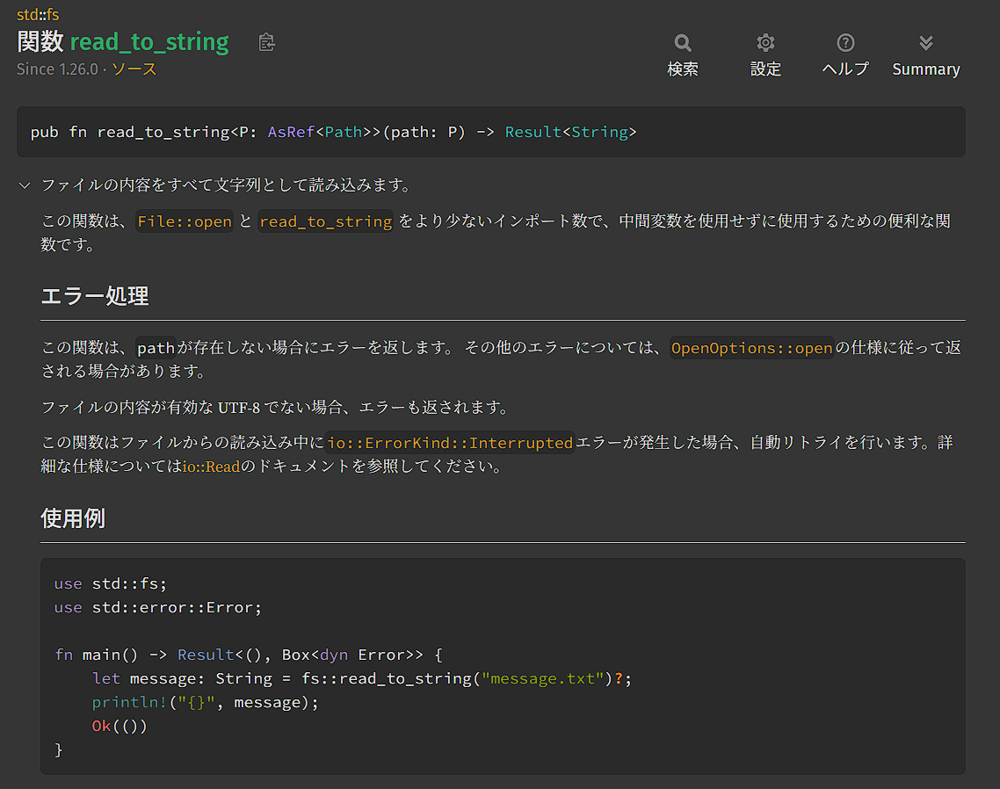
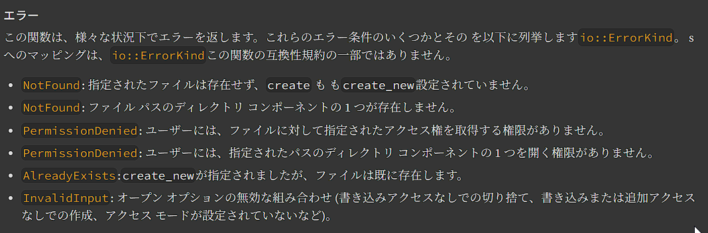

# Grep(1)
まずはファイルを読み込んで、単語をベクタ化します。

ファイルを読み込むには、標準ライブラリの`fs`を使います。

[fs doc](https://doc.rust-lang.org/std/fs/index.html)

せっかくなので、公式ドキュメントを見ながら進めましょう。


## 1. ファイルを読み込んで出力してみる


前に少し触れた`?`演算子を使っています。

エラーはこのように定義されていました


io::ErrorKindには、`.kind`メソッドが実装されているので、それでパターンマッチさせます。
```rust
fn main() {
    
}
```